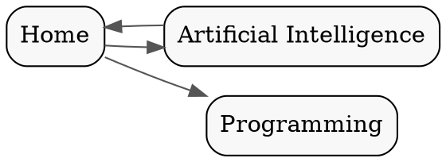
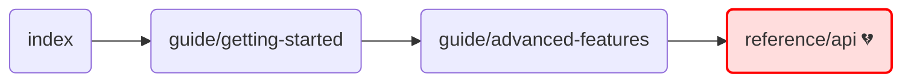

# Markdown Graph Builder


A powerful CLI tool that scans a directory of Markdown files, extracts inter-document links, and builds a directed graph of your content structure. It detects broken links, identifies orphan pages, finds circular dependencies, and can export the graph for visualization.

Ideal for maintaining complex documentation sites, personal knowledge bases (like Zettelkasten or Obsidian vaults), or any project with a large collection of interconnected Markdown files.

---

## Features

-   **Recursive Directory Scanning**: Scans for `.md` and `.markdown` files in any directory structure.
-   **Configurable Patterns**: Use glob patterns to include or exclude specific files and directories.
-   **Robust Link Detection**: Parses relative paths (`./page.md`), absolute paths from root (`/docs/main.md`), and ignores external URLs and anchor-only links.
-   **Link Normalization**: Converts all link styles into a canonical, project-relative format for reliable graphing.
-   **Structural Analysis**:
    -   Identifies **broken links** (dangling references).
    -   Finds **orphan pages** (documents with no incoming links).
    -   Detects **circular dependencies** (e.g., `A -> B -> C -> A`).
-   **Front-matter Aware**: Parses YAML front-matter to add metadata (like `title`) as attributes to graph nodes.
-   **Multiple Export Formats**:
    -   **`report`**: A JSON summary of the analysis (broken links, orphans, etc.).
    -   **`json`**: The full graph data in a machine-readable format.
    -   **`dot`**: For visualization with [Graphviz](https://graphviz.org/).
    -   **`mermaid`**: For embedding diagrams directly into Markdown files (e.g., on GitHub).

## Installation

You can install the tool globally via npm to use it as a command-line utility anywhere on your system.

```bash
npm install -g markdown-graph-builder
```

Alternatively, you can clone the repository and run it locally, which is useful for development:

```bash
git clone https://github.com/your-username/markdown-graph-builder.git
cd markdown-graph-builder
npm install
# Run using npm link or directly
npm link
md-graph --help
```

## Usage

The basic command structure is `md-graph <directory> [options]`.

```bash
md-graph <directory> [options]
```

### Arguments

-   `<directory>`: (Required) The source directory to scan for Markdown files.

### Options

| Option                         | Alias | Description                                                               | Default                               |
| ------------------------------ | ----- | ------------------------------------------------------------------------- | ------------------------------------- |
| `--output <file>`              | `-o`  | The file path to write the output to. Prints to stdout if not specified.  | `stdout`                              |
| `--format <format>`            | `-f`  | The output format. Choices: `report`, `json`, `dot`, `mermaid`.           | `report`                              |
| `--exclude <patterns...>`      |       | Glob patterns to exclude from the scan.                                   | `**/node_modules/**`, `**/.git/**`    |
| `--pretty`                     |       | Format the JSON output for readability.                                   | `false`                               |
| `--help`                       | `-h`  | Display help for the command.                                             |                                       |

## Examples

### 1. Generate an Analysis Report

Scan a `docs` directory and print a JSON report of broken links, orphans, and cycles to the console. This is the default behavior.

**Command:**

```bash
md-graph ./docs
```

**Expected Output (to stdout):**

```json
{
  "totalNodes": 5,
  "totalEdges": 6,
  "brokenLinks": [
    {
      "source": "guide/advanced",
      "target": "api/v2-reference",
      "rawLink": "../api/v2-reference.md"
    }
  ],
  "orphanPages": [
    {
      "id": "legal/privacy-policy",
      "absolutePath": "/path/to/project/docs/legal/privacy-policy.md"
    }
  ],
  "circularDependencies": [
    [
      "guide/setup",
      "guide/configuration",
      "guide/setup"
    ]
  ],
  "stats": {
    "nodeCount": 5,
    "edgeCount": 6,
    "density": 0.3
  }
}
```

### 2. Export a Graph for Visualization with Graphviz

Scan a directory and save the output as a `.dot` file. You can then use a tool like Graphviz to render it as an image.

**Command:**

```bash
md-graph ./my-knowledge-base -f dot -o graph.dot
```

**Generated `graph.dot` file:**



To generate an SVG image from this file:

```bash
dot -Tsvg graph.dot -o graph.svg
```

### 3. Generate a Mermaid Diagram for GitHub

Create a Mermaid syntax graph definition and save it to a file. You can then paste this into a GitHub README or issue to render the diagram automatically.

**Command:**

```bash
md-graph ./src -f mermaid -o diagram.md
```

**Generated `diagram.md` file:**

````markdown

````

When pasted into a Markdown file on a platform that supports Mermaid, this will render a visual graph.

## License

This project is licensed under the MIT License. See the [LICENSE](LICENSE) file for details.